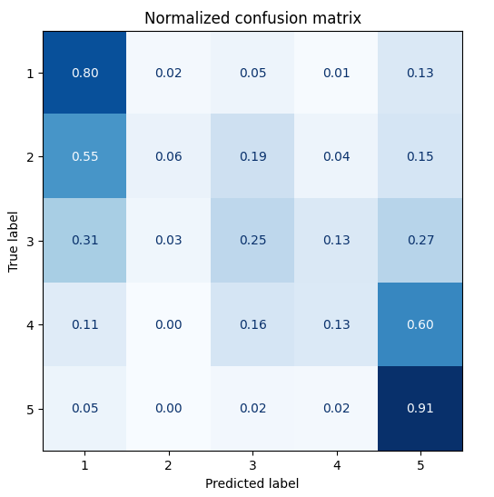
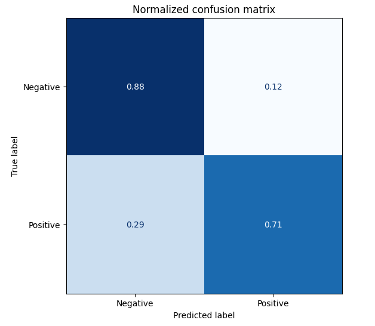
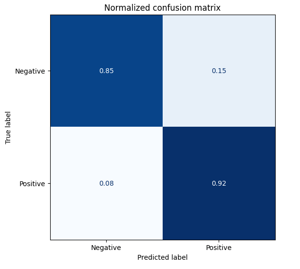
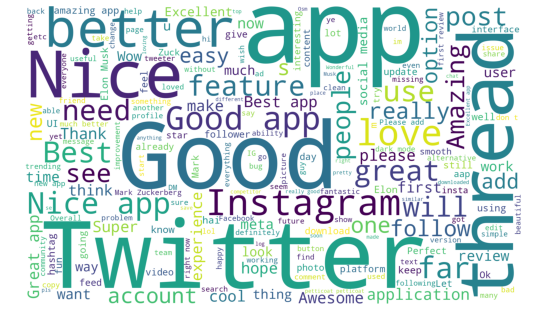
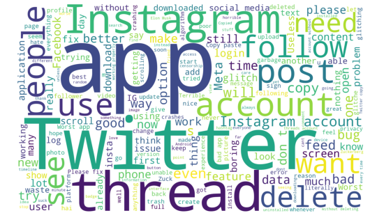

# Threads-reviews-NLP

This project employs NLP methods to classify reviews of the Threads app, sourced from [Kaggle](https://www.kaggle.com/datasets/saloni1712/threads-an-instagram-app-reviews). Every review is associated with a rating ranging from 1 to 5. Thus, the initial objective of this project is to train a DistilBERT model for the classification of reviews into five different ratings. The resulting confusion matrix of this model is as follows:

| Accuracy | F1-score | 
|----------|----------|
| 0.69     | 0.65     | 

From the confusion matrix it is evident that most errors occur because 2-star reviews are mistaken for 1-star reviews and 4-star reviews are wrongly labeled as 5-star reviews. One way to address this issue is to transform the 5-star rating system into two categories: positive and negative reviews. This way 1-star and 2-star reviews would be classified as negative reviews and 4-star and 5-star reviews would be labeled as positive reviews. Such transformation might lead to higher accuracy because the contrasts between the categories might be more distinct. Neutral reviews with a rating of 3 are excluded, as they constitute less than 10% of the total reviews.

Initially, a built-in sentiment analysis pipeline is used without fine-tuning to accomplish this task. The outcome of the model is as follows:

| Accuracy | F1-score | 
|----------|----------|
| 0.78     | 0.78     | 

Based on the results, it is apparent that the classification into negative and positive classes yielded higher accuracy even without the need for fine-tuning. To assess the impact of fine-tuning on performance, DistilBERT is fine-tuned to classify reviews as either negative or positive. The resulting confusion matrix of the fine-tuned model is as follows:

| Accuracy | F1-score | 
|----------|----------|
| 0.89     | 0.89     | 

The results clearly indicate that fine-tuning contributed to an increase in both accuracy and F1-score, however the performance in the classification of negative reviews decreased slightly, but this is more than compensated by the improvement in the classification of the positive class. Additionally, the proportion of misclassifications notably decreased in comparison to the initial rating-based classification.

To gain a deeper insight into the factors influencing various reviews, one can create word clouds for both positive and negative reviews:

The word cloud highlights that negative reviews often revolve around concerns such as app glitches, crashes, and dissatisfaction with the content. On the other hand, positive reviews commonly mention aspects like the user interface, features, and social media integration. For a more in-depth understanding of these observations, we can filter rows where these terms are mentioned. From filtered texts it is evident that some people give negative reviews due to the glitches and crashes in the system when uploading photos, scrolling the feed and typing. In addition, users are not satisfied with the content as they are shown suggested posts instead of only the posts of people that they are following. From the positive reviews it is apparent that people are satisfied with the interface of the app as it is convenient and easy to use. However, some users do point out the absence of features like hashtags and direct messages.